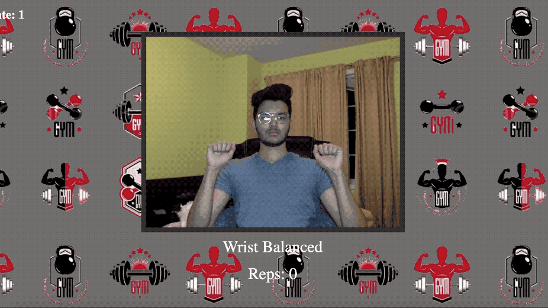
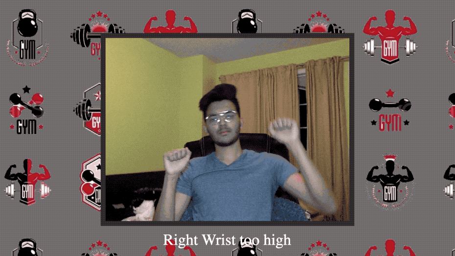

# APTraining

Developed this project with a group for Steacie Library HackFest 2020.

Leverages Tensorflow Library BodyPix to correct your form as you do an over head press. It also keeps track of repetitions.
We also used google translate to tell you when one of your wrists is higher than the other.

1. Repetition Counter 

2. Wrist Imbalances

